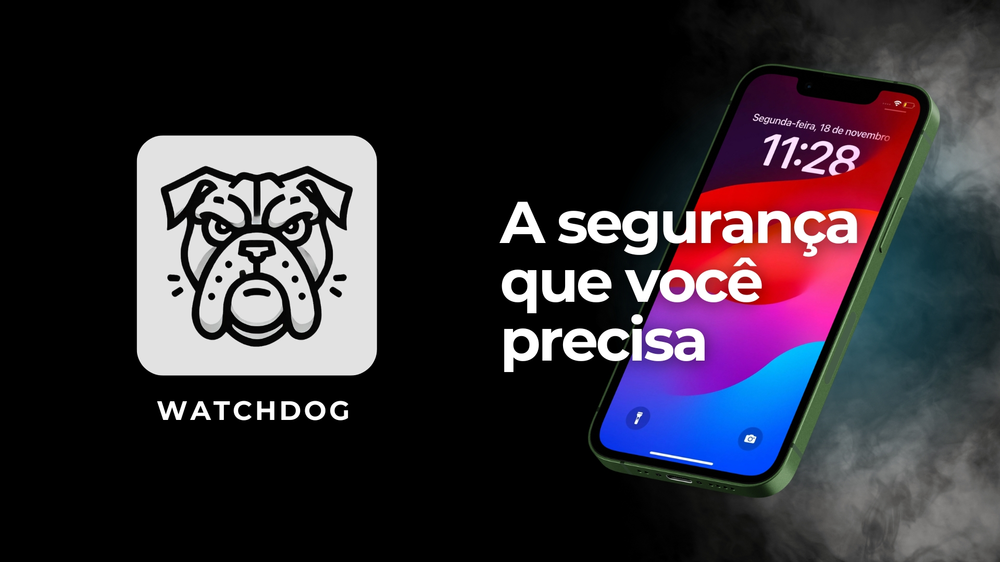

# FECAP - Fundação de Comércio Álvares Penteado

# WatchDog

## Integrantes: <a href="">Demetrio Henrique Souza Cleto</a>, <a href="">Lucca Gomes Vieira</a>, <a href="">Luigi Augusto Bezerra Consentino</a>, <a href="">Mateus Macedo Batista de Souza</a>, <a href="">Mateus Sousa Piccinin</a>, <a href="">Matheus Andrade Mauro</a>, <a href="">Nathan Camargo de Oliveira Silva</a>,  <a href="">Thiago Henrique Martinho da Silva</a>

## Professores Orientadores: <a href="https://www.linkedin.com/in/edsonbarbero/">Edson Barbero</a>, <a href="https://www.linkedin.com/in/victorbarq/">Victor Bruno Alexander Rosetti de Quiroz</a>, <a href="https://www.linkedin.com/in/lucymari/">Luci Mari Tabuti</a>, <a href="https://www.linkedin.com/in/eduardo-savino-gomes/">Eduardo Savino Gomes</a>, <a href="https://www.linkedin.com/in/aimarlopes/">Aimar Martins Lopes</a>

## Sobre o Projeto

O **Watchdog** é uma solução inovadora de segurança digital criada para proteger o que realmente importa: os dados e a privacidade dos usuários. Focado em acessibilidade e eficácia, o Watchdog oferece dois produtos complementares:

1. **Serviço de Configuração de Segurança para Celulares**  
   Um serviço personalizado que configura o dispositivo do cliente para protegê-lo contra acessos indevidos em caso de roubo ou perda, incluindo dicas práticas para manter os dados seguros.

2. **Chatbot de Criptografia de Arquivos**  
   Um chatbot que permite a criptografia de arquivos de forma simples e segura, gerando códigos únicos que são armazenados localmente em um pen drive. O arquivo criptografado só pode ser acessado quando o pen drive está conectado à máquina, garantindo uma camada adicional de segurança.

---

## Intuito do Projeto

Nosso objetivo é tornar a segurança digital prática, acessível e personalizada. Com o Watchdog, queremos capacitar os usuários a protegerem seus dispositivos e informações sensíveis contra ameaças cada vez mais frequentes, garantindo sua tranquilidade em um mundo digital em constante evolução.

---

## Impacto do Projeto

- Reduzir o impacto de roubos de dispositivos móveis, prevenindo acessos indevidos a dados pessoais, informações financeiras e aplicativos bancários.
- Oferecer uma solução inovadora e acessível para proteger arquivos confidenciais em computadores, tornando a criptografia mais simples para todos.
- Proporcionar maior educação digital para nossos clientes, com orientações práticas que aumentam a conscientização sobre segurança.

Nosso impacto vai além da tecnologia: ajudamos pessoas e empresas a se sentirem mais seguras e protegidas em um cenário digital cada vez mais desafiador.

---

## A Pivotagem do Projeto

O Watchdog começou como um **chatbot para análise de possíveis golpes**, mas percebemos que o modelo original tinha dificuldade em monetizar, já que era complicado cobrar por uma solução que verificava possíveis fraudes. Após analisar as necessidades reais de segurança digital, pivotamos o projeto para oferecer:

- **Um serviço de configuração de segurança para celulares**, focado em proteger os dados do cliente de forma prática e acessível.
- **Um chatbot para criptografia de arquivos**, que gera códigos únicos e oferece uma camada extra de proteção, incluindo backup em nuvem para evitar perdas.

Essa mudança permitiu criar um modelo de negócio mais sólido e alinhado às demandas do mercado, enquanto continuamos impactando positivamente a vida de nossos usuários.

-Raiz
|
|-->documentos
 |-->Ciência de Dados
 |-->Analise_de_Violacao_de_Dados.pdf
 |-->basededados_com_grafico_impactoSocial.xlsx
 |-->dataset_cybersecurity.ipynb
 |-->df_1.csv
 |-->Inteligência Artificial
 |-->PI_AI.ipynb
 |-->Segurança da Informação e Cibernética
 |-->Teste de mesa_Criptografia.pdf
|-->imagem
 |-->logo-dataSafeIA.png
|-->src
 |-->Frontend
 |-->instruções.txt
 |-->resumos.txt
 |-->cript_dbPiBackend.txt
|.gitignore
|readme.md
